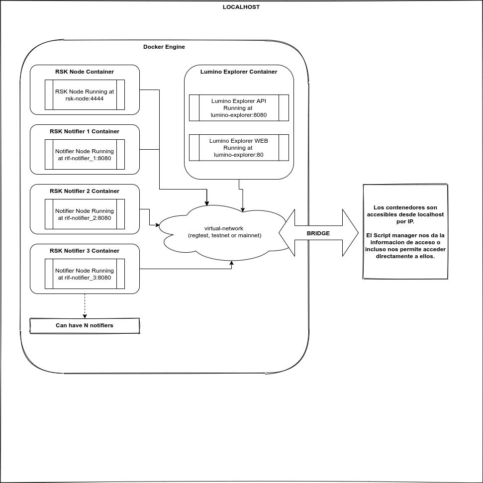

### Introduction

Docker for lumino aims to create a fully operational environment for the lumino node where we can test different 
network topologies and several integration tests without having to install all the rsk environment locally.

### How it works

In this folder we have a folder called `scripts` and inside we have all the scripts and data to manage docker for lumino. 
Basically what we can do is to start an environment where we can test lumino by running temporal clean environments or 
use an existent RSK database. The main script called `manager` inside the scripts folder works as a centralized
manager for docker commands, so you don't need to know all the scripts under the hood, but if you want to learn docker
you can do it from [here](https://docs.docker.com/engine/reference/builder/).

We use docker and docker-compose for these scripts. The manager script let us create containers for a rsk-node,
notifiers and lumino-explorer for now, in the future we want to add containers for lumino too so we can have
all the infrastructure up and running without having to run or install anything locally.

#### How to use it

To use the `manager` script you only need to have installed `docker` and `docker-compose` in your system. That's
the only requirement for running the lumino environment in docker.

Now you can use the manager by running the `manager` script. The usage of the manager script is localed in the
file `scripts/usage.md` or you can run `./manager --help` to get that information.

##### Why do i need this?

You don't need to run docker to work with lumino, you can setup your own environment manually by downloading
the rsk node, installing all the contracts generating a usable database and then running everything locally. But
why is this docker manager useful? Well basically because it takes a lot of time to do all the setup and also 
a lot of resources on your computer, you have to install a lot of dependencies and programs for databases and nodes
that will take up your memory and disk up to the limits. What we do with this is to avoid having to spend a lot
of time creating all the environment manually and configuring all the addresses and contracts, the manager does
all that automatically for us. Also you avoid having to install a lot of dependencies and necessary programs on
your computer optimizing the memory and disk consumption. But regarding the time and resource consumption, also 
it makes our development time more efficient, since we can have an environment up and running with a clean 
database each time we start all the environment, for development that is really productive.

##### How is the environment structure?

The manager starts all the modules if you don't specify other way, that means it will start the rsk-node, the 3 notifiers
and the lumino-explorer all in separated containers running in a local network connected to our localhost using
a bridge. Here is a diagram of what docker starts on our machine:

### Usage Examples

#### Run the entire environment (all modules) in using regtest network

To do this you simply use the next command:

`./manager --start`: That will execute a sync start that will show all the
container logs and you will need to use Ctrl+c to kill everything.

To run everything in background you can use:
`./manager --start --background`: that will do the same as above command but it will
start everything in background and show you a summary with all the container IP's.

**NOTE: the second command it's the recommended option since it releases the terminal to the user.**

If you forgot the container IP's you can get them by executing:
`./manager --ip`

#### Run the entire environment (all modules) in using testnet or mainnet network

To do this you can use:
`./manager --start --testnet --rsk-db-path=/path/to/rsk/database` for testnet or 
`./manager --start --mainnet --rsk-db-path=/path/to/rsk/database` for mainnet.

The difference here are the flags `--testnet` or `--mainnet` and `--rsk-db-path`.
Rather than that everything else is the same as regtest.

#### Run only rsk-node instead of all the environment

Use the next command for this:
`./manager --start-modules=rsk-node`: this will start only the rsk-node module in background and it will print the container IP at the end.

You can do this for every module, if you want to do this with lumino-explorer you can do this by changing the 
module name like this `./manager --start-modules=lumino-explorer`

#### Specify the number of notifiers to run (by default 3)
You can run a specific number of notifiers by running this:
`./manager --start --background --notifiers=2`: this will start regtest in background with only 2 notifier replicas.

Each notifier replica will run in a separated container and it will have a different database schema.

#### Connect to a specific container

For example if we want to connect to the RSK Node container we can execute:
`./manager --connect=rsk-node`: this will try to connect to the RSK node container if we are running on regtest.

#### Stop everything
`./manager --stop`: stop everything for regtest environment.
`./manager --stop --testnet`: stop everything for testnet environment.
`./manager --stop --mainnet`: stop everything for mainnet environment.

#### Stop a specific module
`./manager --stop-module=rsk-node`: stop rsk-node for regtest environment.
`./manager --stop-module=rsk-node --testnet`: stop rsk-node for testnet environment.
`./manager --stop-module=rsk-node --mainnet`: stop rsk-node for mainnet environment.

#### Other information
Each background command it's sequential so you have to be careful, for example if you 
want to connect to rsk-node and you run `./manager --connect=rsk-node` but never started
the rsk-node before then it will fail.

Other flags are described on the file `scripts/usage.md` or you can use `./manager --help` to see that too.